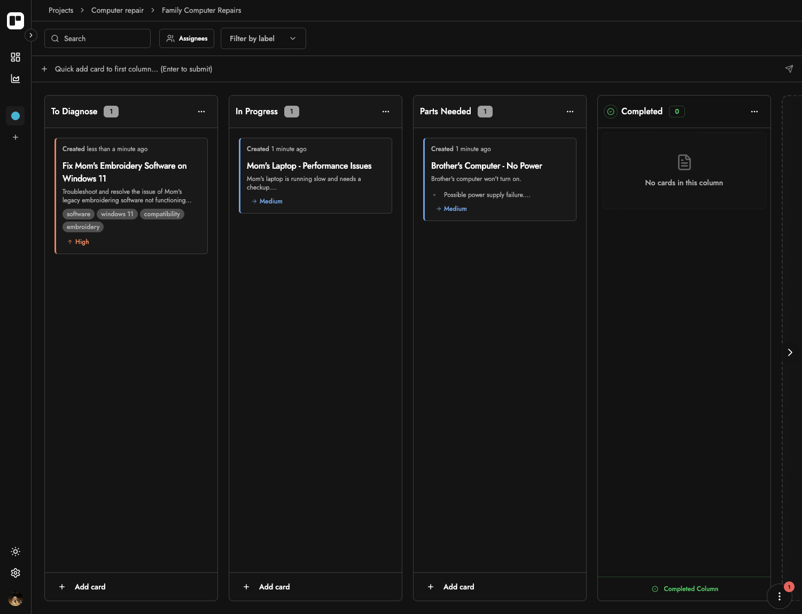

# Cardboards

[](https://opensource.org/licenses/MIT)

**Cardboards** is a modern, AI-enhanced Kanban project management tool designed to streamline your workflow, foster team collaboration, and provide insightful analytics. Built with Next.js, tRPC, Drizzle, and Clerk.

🔗 **Live Site:** [https://www.mycardboards.com](https://www.mycardboards.com)



## ✨ Key Features

* **Intuitive Kanban Boards:** Drag & drop cards, customizable columns, rich task details.
* **Real-time Collaboration:** Changes instantly reflect for all team members via Pusher.
* **AI-Powered Assistance:**
  * Generate entire boards based on a prompt.
  * Generate individual cards with AI suggestions.
  * AI-driven insights for projects and boards.
* **Comprehensive Project Management:**
  * Organize work into distinct Projects and Boards.
  * Role-based access control (Admin/Member).
  * Invite team members via shareable links.
* **Detailed Task Management:**
  * Rich text descriptions with a Tiptap-based editor.
  * Due dates, priorities, labels, and assignees.
  * Card-specific comments and activity history.
* **Insightful Analytics:**
  * Project progress, task completion trends, user activity.
  * Distribution charts for priorities and due dates.
* **Modern User Experience:**
  * Secure authentication with Clerk.
  * Real-time notifications.
  * Responsive design with Dark/Light mode.

## 🛠️ Tech Stack

* **Framework:** [Next.js](https://nextjs.org/) (App Router)
* **Language:** [TypeScript](https://www.typescriptlang.org/)
* **API:** [tRPC](https://trpc.io/)
* **ORM:** [Drizzle ORM](https://orm.drizzle.team/)
* **Database:** [PostgreSQL](https://www.postgresql.org/)
* **Authentication:** [Clerk](https://clerk.com/)
* **UI:** [Tailwind CSS](https://tailwindcss.com/), [Shadcn/UI](https://ui.shadcn.com/)
* **Real-time:** [Pusher](https://pusher.com/)
* **AI:** Google Gemini / OpenAI via Vercel AI SDK
* **Testing:** [Vitest](https://vitest.dev/)

## 🚀 Getting Started

Follow these instructions to get a local copy up and running.

### Prerequisites

* Node.js (v20.x or later recommended)
* pnpm (v9.x or later recommended)
* Docker (for running PostgreSQL locally)

### Installation

1. **Clone the repository:**
   ```bash
   git clone https://github.com/klstein7/cardboards.git
   cd cardboards
   ```

2. **Set up environment variables:**
   * Copy the example environment file:
     ```bash
     cp .env.example .env
     ```
   * Populate your `.env` file with the necessary API keys and secrets.

3. **Install dependencies:**
   ```bash
   pnpm install
   ```

4. **Set up the database:**
   * Start the PostgreSQL Docker container:
     ```bash
     sh ./start-database.sh
     ```
   * Run Drizzle migrations:
     ```bash
     pnpm db:migrate
     ```

5. **Run the development server:**
   ```bash
   pnpm dev
   ```
   The application should now be running on [http://localhost:3000](http://localhost:3000).

## 🧪 Running Tests

To run the test suite:
```bash
pnpm test
```

For coverage reports:
```bash
pnpm test:coverage
```

## 🤝 Contributing

Contributions are welcome! Please feel free to submit a Pull Request.

## 📜 License

This project is licensed under the MIT License - see the [LICENSE](LICENSE) file for details.